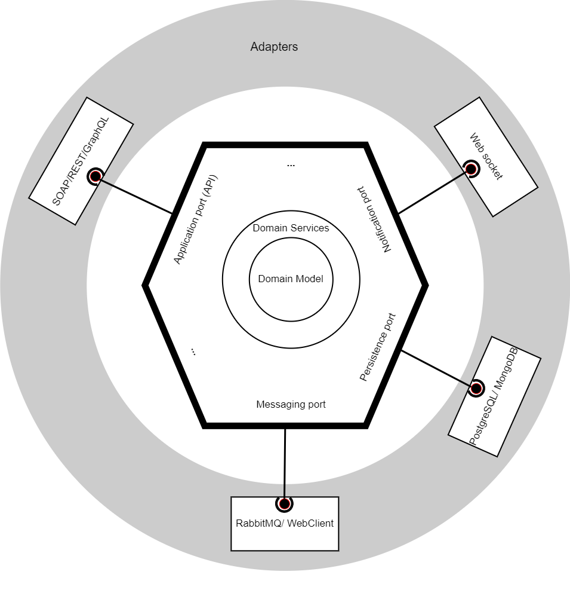

# SPRING BOOT HEXAGONAL ARCHITECTURE QUICK START

## <br>Description

This repository contains the code of an example hexagonal architecture based spring boot project.<br>This quick start consists of adding a simple user in a database with a specific validation.

## How to start

```bash
docker-compose -f <docker-compose file> up -d --build
```

Choose the convenient docker compose file (dev or the default one which is for production/QA), then the application should be started at port 8080.<br>If you start the dev docker-compose, an attached debugger starts a socket at port 5000 and PostgreSQL DB starts at port 5432.
